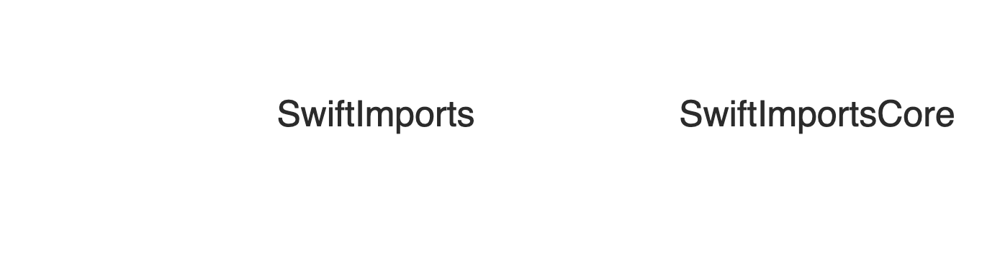

## SCRIPTING 

### **in**

## SWIFT

---

## Francisco Díaz

### *franciscodiaz.cl - @fco_diaz*

^ Originalmente de Valdivia, Chile

^ iOS Development in 2011

^ Vivo en Seattle, Washington

^ Trabajo en Airbnb desde el 2017 en Dev Tools

---

Hello World

^ Empecemos de lo más básico

---

### Shell scripting

```bash
#!/usr/bin/env bash
echo "hello, world!"
```

^ Hay dos líneas

---
### Shell scripting

```bash
#!/usr/bin/env bash
```

^ La primera línea declara el ambiente que vamos a usar

---

### Shell scripting

```bash
echo "hello, world!"
```

^ What happens if we remove the first line?

---

# Swift

```swift
#!/usr/bin/env swift
print("hello, world!")
```

---

## Estructura de un CLI


^ Hay 3 formas en las que principalmente interactuamos con el usuario

---

**STDIN**

Stream from which a command line program **reads** data

**STDOUT**

Stream of data **produced** by a command line program to output data

**STDERR**

Stream of data **produced** by a command line program to output error messages

---

## STDOUT

---
[.code-highlight: 2]

STDOUT

```swift
#!/usr/bin/env swift
print("hello, world!")
```

---

```shell
➜  NSCoderMexico-2021: ✗ ./example-stdout.swift
hello, world!
```

^ enviar informacion al std output en Swift es extremadamente sencillo

---

```swift
func print<Target>(
  _ items: Any..., 
  separator: String = " ", 
  terminator: String = "\n", 
  to output: inout Target) 
    where Target : TextOutputStream
```

---
[.code-highlight: 5-6]

```swift
func print<Target>(
  _ items: Any..., 
  separator: String = " ", 
  terminator: String = "\n", 
  to output: inout Target) 
    where Target : TextOutputStream
```

^ Podemos usar esta capacidad en standard error

---

### [^Print.swift stdlib]

```swift
public func print(
  _ items: Any...,
  separator: String = " ",
  terminator: String = "\n"
) {
    var output = _Stdout()
    _print(items, separator: separator, terminator: terminator, to: &output)
}
```

[^Print.swift stdlib]: https://github.com/apple/swift/blob/main/stdlib/public/core/Print.swift

---

# Common use cases

- Display to the user
- Used by another program to do further processing

---

## STDERR

---

STDERR

1. TextOutputStream
2. fputs


^ Hay dos cosas que tenemos que entender para poder hacer output a std err

---

## TextOutputStream

```swift
mutating func write(_ string: String)
```

---

```C++
var stderr

int fputs ( const char * str, FILE * stream );
````

^ Writes the C string pointed by str to the stream

---

STDERR

```swift
#!/usr/bin/env swift

import Darwin

struct StderrOutputStream: TextOutputStream {
  mutating func write(_ string: String) { fputs(string, stderr) }
}

var standardError = StderrOutputStream()

print("Some error", to: &standardError)

exit(1)

```

---

```shell
➜  NSCoderMexico-2021 ✗ ./example-stderr.swift
Some error
```

---

# Common use case

- Show an error to the user

---

## STDIN

---

STDIN

```swift
#!/usr/bin/env swift

import Foundation

let arguments = CommandLine.arguments

print("Arguments: \(arguments)")
```

---

```shell
➜  NSCoderMexico-2021 ✗ ./shell/example-stdin.swift
Arguments ["./shell/example-stdin.swift"]


➜  NSCoderMexico-2021 ✗ ./shell/example-stdin.swift nscoder mexico 2021
Arguments ["./shell/example-stdin.swift", "nscoder", "mexico", "2021"]
```

---

## [^Swift Argument Parser]

```swift
import ArgumentParser

struct Repeat: ParsableCommand {
    @Flag(help: "Include a counter with each repetition.")
    var includeCounter = false

    @Option(name: .shortAndLong, help: "The number of times to repeat 'phrase'.")
    var count: Int?

    @Argument(help: "The phrase to repeat.")
    var phrase: String

    mutating func run() throws { ... }
}
```

[^Swift Argument Parser]: https://github.com/apple/swift-argument-parser

---

# Common use case

- Take information from the user

---

## Example:

### Find files that are using a deprecated library

^ En Airbnb tenemos muchas librerias
^ Queremos que los desarrolladores usen las tecnologias mas modernas

---

### Find files that are using a deprecated library

```swift
import DeprecatedLibrary
import Foundation

...
```

^ Una opción es en base a los imports

---

## Swift Package Manager[^1]

> The Swift Package Manager is a tool for managing distribution of source code, aimed at making it easy to share your code and reuse others’ code.

[^1]: https://github.com/apple/swift-package-manager

---

```swift
swift package init --name SwiftImports --type executable
```

---

```swift
// swift-tools-version:5.3
// The swift-tools-version declares the minimum version of Swift required to build this package.

import PackageDescription

let package = Package(
  name: "SwiftImports",
  dependencies: [
    // Dependencies declare other packages that this package depends on.
    // .package(url: /* package url */, from: "1.0.0"),
  ],
  targets: [
    // Targets are the basic building blocks of a package. A target can define a module or a test suite.
    // Targets can depend on other targets in this package, and on products in packages this package depends on.
    .target(
      name: "SwiftImports",
      dependencies: []),
    .testTarget(
      name: "SwiftImportsTests",
      dependencies: ["SwiftImports"]),
  ]
)
```

^ Primero definimos la version de swift

^ Luego el nombre del paquete

^ Luego las dependencias externas

^ Luego los targets -> Podemos pensarlos como modulos en iOS

---
[.code-highlight: 3-11]

```swift
let package = Package(
  name: "SwiftImports",
  platforms: [
    .macOS(.v10_13)
  ],
  products: [
    .executable(name: "swiftimports", targets: ["SwiftImports"]),
  ],
  dependencies: [
    .package(url: "https://github.com/apple/swift-argument-parser", .upToNextMinor(from: "0.4.0")),
  ],
  targets: [
    .target(
      name: "SwiftImports",
      dependencies: []),
    .testTarget(
      name: "SwiftImportsTests",
      dependencies: ["SwiftImports"]),
  ]
)
```

^ Vamos a definir primero un par de cosas:

^ La minima plataforma que soportamos

^ El ejecutable: que va a ser el nombre del binario que vamos a generar

^ Y luego como nombre antes vamos a depender de Swift Argument Parser

---

### SwiftImports
### SwiftImportsCore

---

### SwiftImports

- Parses input from user (Handles STDIN)
- Outputs to user (Handles STDOUT / STDERR)

---

### SwiftImportsCore

- Does the business logic of the tool

---



---
[.code-highlight: 13-23]

```swift
let package = Package(
  name: "SwiftImports",
  platforms: [
    .macOS(.v10_13)
  ],
  products: [
    .executable(name: "swiftimports", targets: ["SwiftImports"]),
  ],
  dependencies: [
    .package(url: "https://github.com/apple/swift-argument-parser", .upToNextMinor(from: "0.4.0")),
  ],
  targets: [
    .target(
      name: "SwiftImports",
      dependencies: [
        .target(name: "SwiftImportsCore"),
        .product(name: "ArgumentParser", package: "swift-argument-parser"),
      ]),
    .target(
      name: "SwiftImportsCore"),
    .testTarget(
      name: "SwiftImportsCoreTests",
      dependencies: [.target(name: "SwiftImportsCore"),]),
  ]
)
```

^ Vamos por parte

---

## SwiftSyntax[^2]

> It allows for Swift tools to parse, inspect, generate, and transform Swift source code.

[^2]: https://github.com/apple/swift-syntax

---
[.code-highlight: 5, 14-16]

```swift
let package = Package(
  ...
  dependencies: [
    .package(url: "https://github.com/apple/swift-argument-parser", .upToNextMinor(from: "0.4.0")),
    .package(name: "SwiftSyntax", url: "https://github.com/apple/swift-syntax.git", .exact("0.50300.0")),
  ],
  targets: [
    .target(
      name: "SwiftImports",
      dependencies: [
        .target(name: "SwiftImportsCore"),
        .product(name: "ArgumentParser", package: "swift-argument-parser"),
      ]),
    .target(
      name: "SwiftImportsCore",
      dependencies: ["SwiftSyntax"]),
    .testTarget(
      name: "SwiftImportsCoreTests",
      dependencies: [.target(name: "SwiftImportsCore"),]),
  ]
)
```

---

## Working Example

---

## Why not just regex?

---

```swift
import CoreServices.DictionaryServices
import func Darwin.fputs
@_exported import SwiftImports
```

---

### Binary

```swift
swift build -c release
```

---

# Possible improvements

- Find submodule imports (e.g. `import CoreServices.DictionaryServices`
- Find scoped imports (e.g. `import func Darwin.fputs`)

_a.k.a. this is not production ready_

---

# SwiftInspector

https://github.com/fdiaz/swiftinspector

---

### github.com/*fdiaz/NSCoderMexico-2021*

#### github.com/*fdiaz/swiftinspector*
